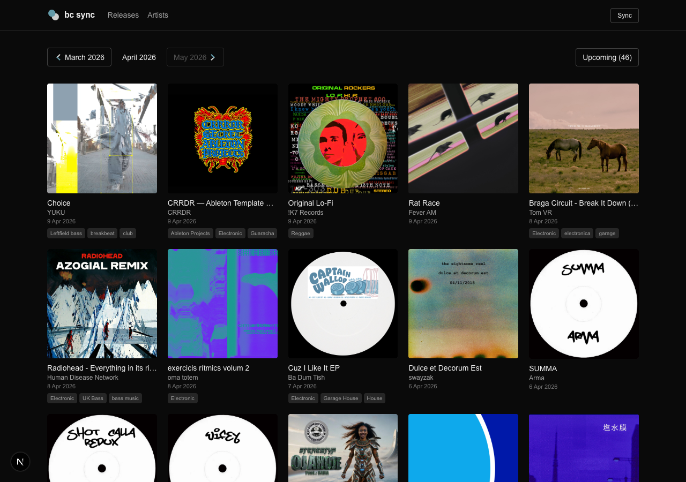
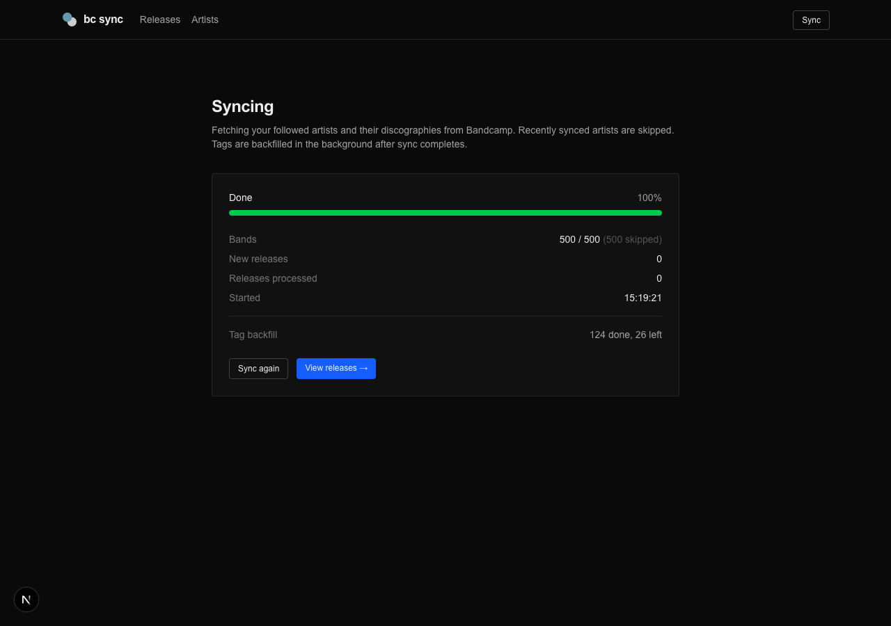
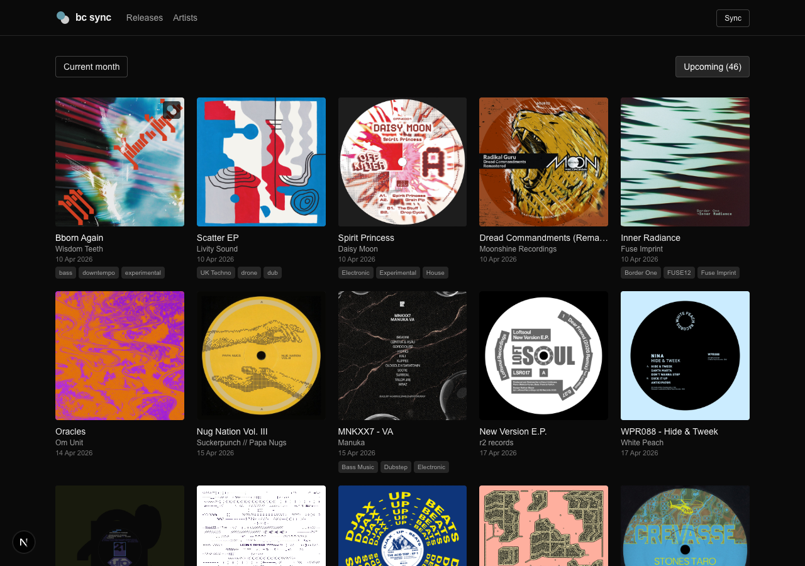
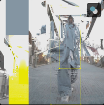

# bc sync

A local web app that syncs your followed Bandcamp artists and shows their releases in a browsable feed, organized by month.



## Prerequisites

You need **Node.js** (v18 or later) and **npm** installed on your machine.

- **macOS** (Homebrew): `brew install node`
- **Windows / macOS / Linux** (official installer): [https://nodejs.org](https://nodejs.org) -- download the LTS version, which includes npm
- **Via nvm** (recommended for managing multiple versions): [https://github.com/nvm-sh/nvm](https://github.com/nvm-sh/nvm)

Verify your installation:

```bash
node -v   # should print v18 or later
npm -v    # should print 9 or later
```

## Setup

### 1. Clone and install

```bash
git clone <repo-url>
cd bandcamp-feed
npm install
```

### 2. Start the dev server

```bash
npm run dev
```

Open [http://localhost:3000](http://localhost:3000).

### 3. Connect your Bandcamp account

On first launch you'll be redirected to the **Setup** page. You'll need two things:

1. **Your Bandcamp username** -- the one from your profile URL (`bandcamp.com/your-username`)
2. **Your identity cookie** -- a session cookie from your browser. Click the **?** button on the setup page for a step-by-step visual guide, or follow these steps:
   - Go to [bandcamp.com](https://bandcamp.com) while logged in
   - Open DevTools (F12) -> Application -> Cookies -> bandcamp.com
   - Copy the value of the `identity` cookie

Enter both values and click **Connect & start syncing**. The app validates your credentials against Bandcamp's API before saving them.

### 4. Initial sync

After setup you'll be taken to the **Sync** page, which starts automatically in two phases:

1. **Fetching followed artists** -- pulls all bands you follow from Bandcamp
2. **Fetching discographies** -- grabs the full release catalog for each artist (recently synced artists are skipped)

After the main sync completes, **tag backfill** runs in the background to fetch genre tags for each release.



The sync page shows real-time progress: bands processed, new releases found, and the current artist being synced.

## Features

### Browse releases by month

The main **Releases** page shows all releases from your followed artists for the current month. Use the month pagination at the top to navigate between months.


Each release card shows the artwork, title, artist, release date, and genre tags. Clicking a release opens it on Bandcamp.

### Upcoming releases

Click the **Upcoming** button in the top-right to see all future-dated releases sorted by date.



### Per-release refetch

When hovering over a release card, a small sync button appears in the top-right corner of the artwork. Clicking it re-fetches that specific release from Bandcamp, which is useful for:

- **Getting tags** if they weren't backfilled yet
- **Fixing the URL** if the wrong one was stored



### Artists

The **Artists** page lists all your followed artists, sorted by most recent release.

### Settings

The **Settings** page (cog icon in the nav bar) lets you:

- **Update your cookie** -- Bandcamp session cookies expire over time. When syncing stops working, paste a fresh cookie here.
- **Change account** -- switch to a different Bandcamp account. This wipes all synced data and starts fresh.

## Data storage

All data is stored locally in a SQLite database at `data/store.sqlite`, created automatically on first run. No external database setup is needed.

## Advanced: `.env.local`

If you prefer to configure credentials via environment variables instead of the in-app setup, copy the example file and fill it in:

```bash
cp .env.local.example .env.local
```

The app checks the database first and falls back to `.env.local`, so either method works.
